# Relatório de atividade avaliativa de S.O.

## Informações gerais
**Atividade 01 – Introdução ao Linux usando Docker no Windows**
**Disciplina:** Sistemas Operacionais (TADS – CNAT/IFRN)  
**Professor:** Leonardo A. Minora  
**Aluno(a):** Maria Clara da Silva Melo


## Introdução
Essa atividade tem como objetivo mostrar o uso básico do sistema operacional Linux, utilizando o Fedora executado dentro de um contêiner Docker. Com o objetivo de praticar comandos de navegação, manipulação de arquivos, permissões, processos e gerenciamento de pacotes.

[texto](url)


## Relato da Atividade

1. Início do Contêiner Fedora
Comando:
```bash
docker run -it --name fedora-tutorial fedora:latest /bin/bash 
```

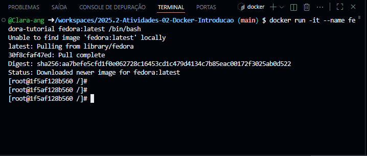

2. Navegação Básica

2.1. Verificar em qual diretório você está:  
   ```bash
   pwd
   ```
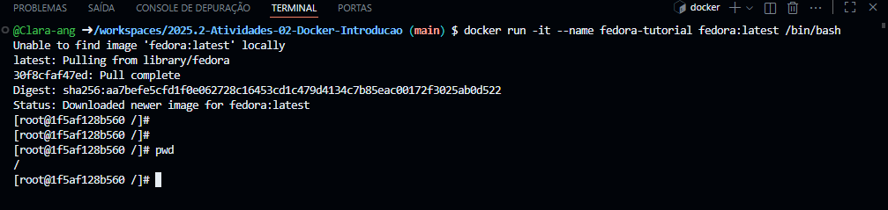

2.2. Acessar o diretório home do usuário
   ```bash
   cd ~
   ```
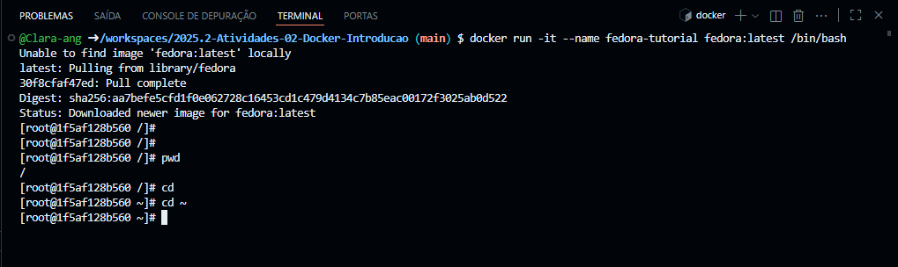

2.3. Liste os arquivos e pastas do diretório atual:  
   ```bash
   ls
   ```
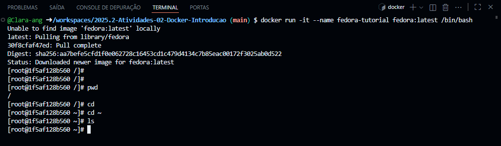

2.4. Crie uma pasta chamada `atividades`:  
   ```bash
   mkdir atividades
   ```
   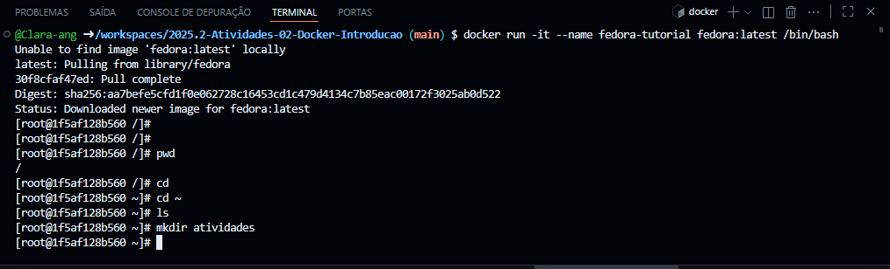
2.5. Entre na pasta `atividades`:  
   ```bash
   cd atividades
   ```
   
2.6. Volte para o diretório anterior (`/`):  
   ```bash
   cd ..
   ```
   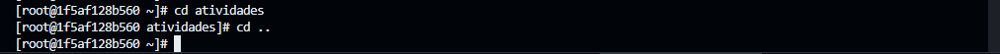
3. Manipulação de Arquivos

Criei, movi, copiei e excluí arquivos utilizando comandos como touch, mv, cp, rm e mkdir.
1. Acesse o diretório home do usuário:
   ```bash
   cd ~
   ```
   - Verifique se está no home:  
     ```bash
     pwd
     ```
2. Crie um arquivo `arquivo1.txt` no diretório home:  
   ```bash
   touch arquivo1.txt
   ```
3. Renomeie o arquivo para `documento.txt`:  
   ```bash
   mv arquivo1.txt documento.txt
   ```
4. Acesse a pasta `atividades` (criada na Atividade 1):  
   ```bash
   cd atividades
   ```
5. Dentro de `atividades`, crie um subdiretório chamado `backup`:  
   ```bash
   mkdir backup
   ```
6. Copie `documento.txt` (do home) para `backup`:  
   ```bash
   cp ~/documento.txt backup/
   ```
   - Verifique se o arquivo foi copiado:  
     ```bash
     ls backup/
     ```
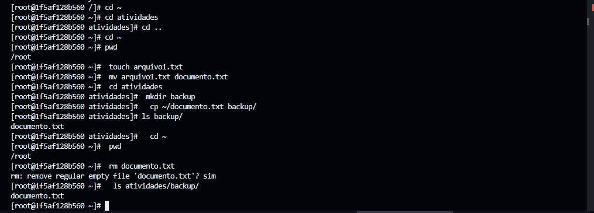

4. Gerenciamento de Pacotes

Utilizei o dnf para atualizar pacotes, instalar e remover o editor nano.

1. Atualize a lista de pacotes:  
   ```bash
   dnf update -y
   ```
   

2. Instale o editor de texto `nano`:  
   ```bash
   dnf install nano -y
   ```
   
3. Verifique se o `nano` foi instalado:  
   ```bash
   nano --version
   ```
   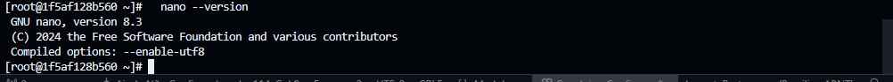

4. Remova o `nano`:  
   ```bash
   dnf remove nano -y
   ```
   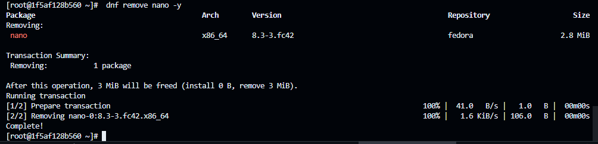


5. Permissões

Foi criado um arquivo script.sh e modificadas suas permissões com chmod u+x.

1. Crie um arquivo `script.sh`:  
   ```bash
   touch script.sh
   ```
   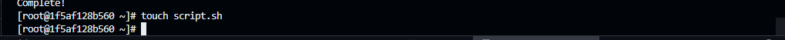
2. Dê permissão de execução ao dono:  
   ```bash
   chmod u+x script.sh
   ```
   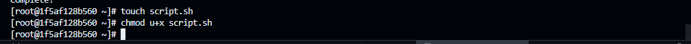

3. Verifique as permissões:  
   ```bash
   ls -l script.sh
   ```
   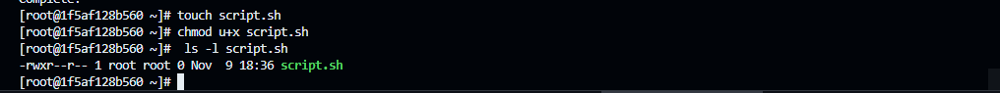


6. Processos

Listei os processos com ps aux, executei sleep 60 & em segundo plano e encerrei o processo com kill.

1. Liste processos em execução:  
   ```bash
   ps aux
   ```
    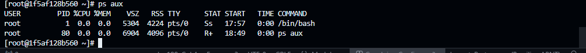
    
2. Execute um processo em segundo plano:  
   ```bash
   sleep 60 &
   ```
   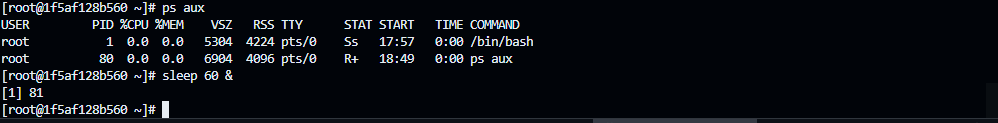

3. Encontre o **PID** do processo `sleep`:  
   ```bash
   ps aux | grep sleep
   ```
   

4. Encerre o processo:  
   ```bash
   kill <PID>
   ```
    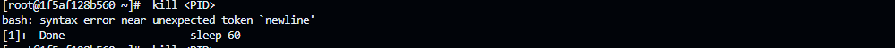


7. Encerramento do Contêiner

Por fim, o contêiner foi encerrado com exit e removido com docker rm fedora-tutorial.

1. Saia do contêiner:  
   ```bash
   exit
   ```
    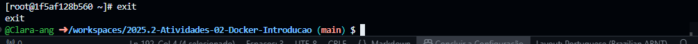

2. Remova o contêiner após o uso:  
   ```bash
   docker rm fedora-tutorial
   ```
   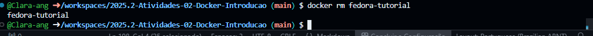

---


## Conclusão
A me fez compreender melhor o funcionamento básico do Linux, dentro de um ambiente isolado como o 
Docker.Aprendi comandos para gerenciamento de pacotes e permissões de arquivos e tive como maior dificuldade a instalação e configuração inicial do Docker, mas após isso a execução dos comandos foi tranquila.


